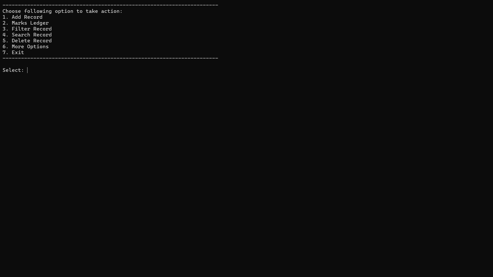
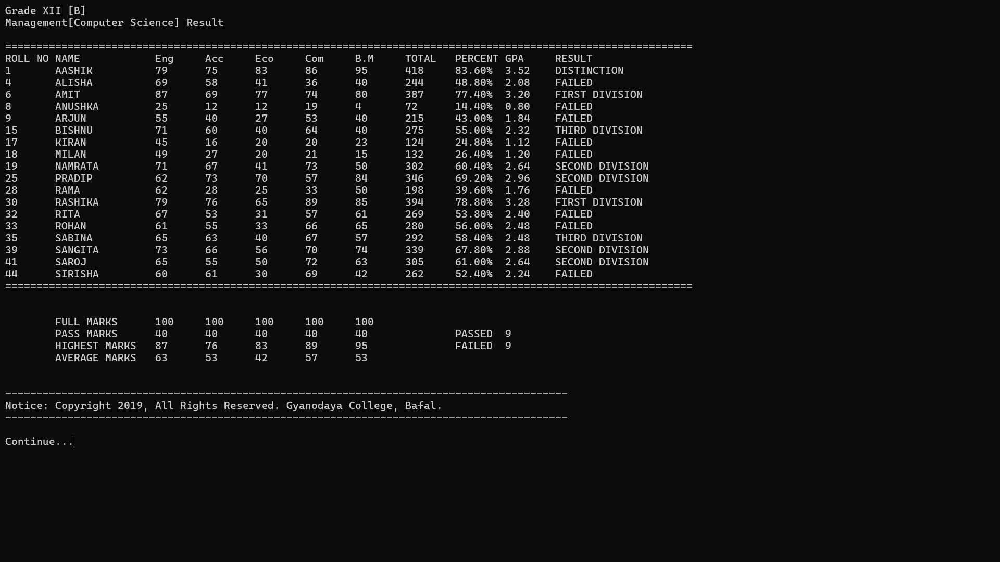
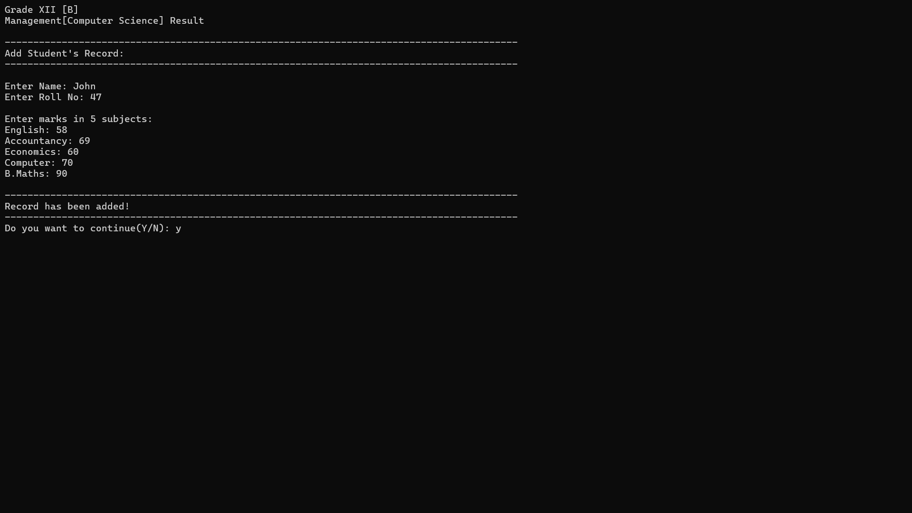
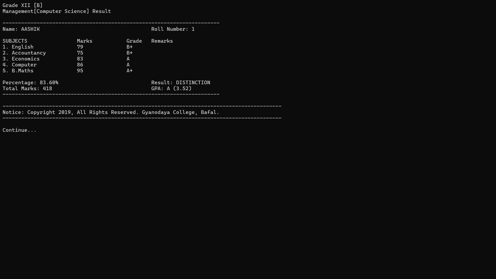

# Grade 12 Result Management System (NEB) (C Programming) (File Handling)

This is the Result Management System created using the C programming language. It is a purely CUI-based application and operates extremely fast. The program offers several features:

## Features:
1. Adding student's result to the database
2. Viewing all the students' records at once
3. Filtering / sorting the students' records from GPA to highest marks
4. Searching for a specific student in the database
5. Deleting a student
6. Software information

**Note:** Please do not delete the "Program Files" folder as it contains all the necessary files for the program to operate. If you delete that folder, our program will recreate it again.

Feel free to modify the code and make it your own.

This software is fully written by Aashish Maharjan.

[Visit Linkedin](https://www.linkedin.com/in/aacismaharjan/)

